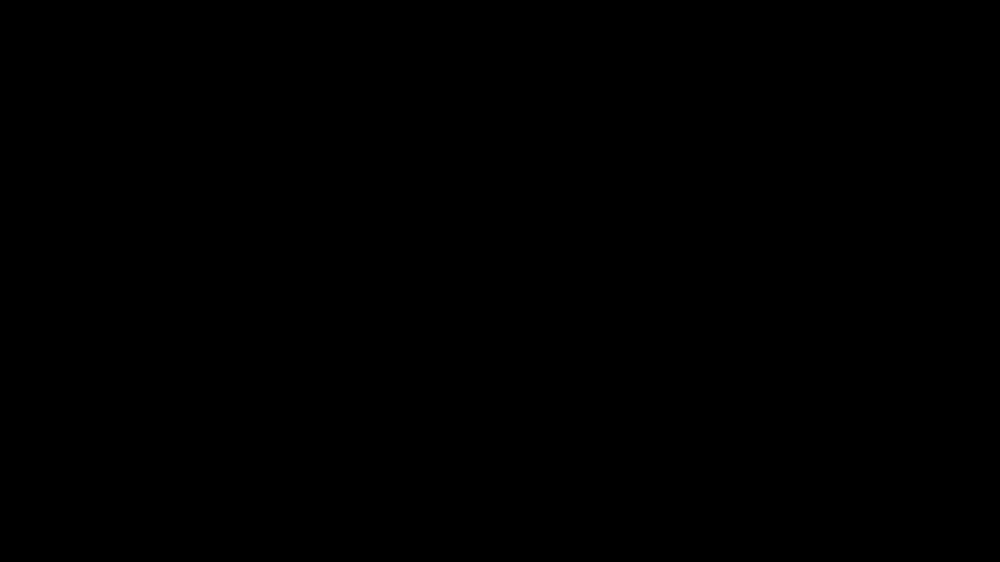

# Rashat

ランダムで6方向へ1つ前と被らないように移動できるアニメーション効果

## 最新 / Latest

**v2.1**

## 各パラメータ

* ### in/out
> [!IMPORTANT]
> 直線移動での動作推奨。
>
> `-100～0`に移動すると登場、`0～100`へ移動すると退場になります。

* ### ズレ
> どれくらいずれてアニメーションするかを指定します。

* ### 動き
> [!CAUTION]
> 必ず0から100へ移動させてください。
>
> カーブはお好みで。

* ### seed
> ランダムのシード値。

* ### 移動距離
> 個々のオブジェクトが移動する距離を指定します。

* ### 有効方向指定
> 移動可能な方向を指定します。
>
> ※ `x, -x, y, -y, z, -z`の6種を指定可能。
>
> `x,-x`で横方向のみ移動 など

* ### 被りあり
> 個別オブジェクトにおける1つ前の動作と被らないようにするか否かを指定します。

* ### フェード
> 100%状態に近づくにつれてフェード効果を付与します。

* ### in/out非表示
> 100%状態のとき非表示にします。

* ### 拡大率
> 100%状態に近づくにつれて拡大率を変更します。

* ### ぼかし
> 100%状態に近づくにつれてぼかし効果を付与します。

* ### order
> アニメーション順番を指定します。

## 変更履歴 / Change log

- 2.1
    - 個別オブジェクト以外での使用を許可

- 2.0
    - AviUtl2バージョンのリリース