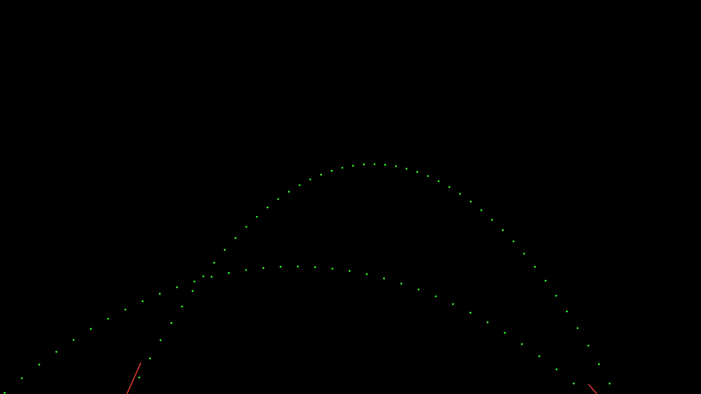

# 投射

投射したような挙動をするアニメーション効果

### [導入方法](https://github.com/nea-c/AviUtl-Scripts/archive/refs/heads/master.zip)

## 最新 / Latest

**r1**

## 各パラメータ

* ### 投射角度
> オブジェクトに与える初速度の方向を操作します。

* ### Z投射角度
> オブジェクトに与える初速度のZ方向を操作します。

* ### 初速度
> オブジェクトに与える初速度を操作します。

* ### 重力
> 重力の大きさを操作します。
>
> 無重力状態にもできます。

* ### 重力方向
> 重力のかかる方向を操作します。

* ### マニュアル動作
> 時間の影響を受けなくなり、下のprogressで操作することが可能になります。

* ### カメラの方向を向く
> カメラ制御時に必ずカメラの方向を向くようになります。

* ### ガイド表示
> どのように移動するかのガイドを表示します。

* ### 出力時ガイド非表示
> 出力時にガイドが自動で非表示になります。

## 変更履歴 / Change log

- r1
    - AviUtl2バージョンのリリース